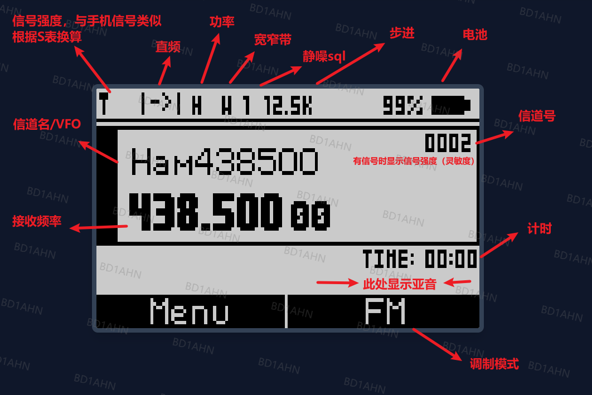
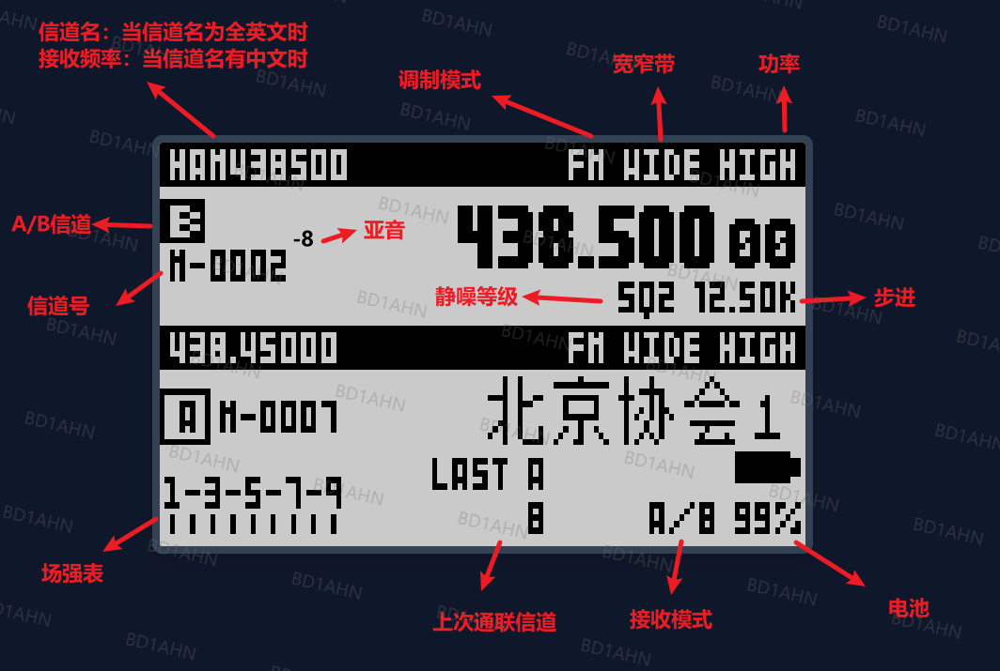

# 1. 常见使用场景

## 1.1 扫描信道

1. 需要先给每个频率选择其所属信道列表（网页写频中写入或者"信道">"信道列表"中设置）
2. MENU 进入菜单，"其它" > "扫描列表" 选择要扫描的列表
3. 主页中，信道模式下，长按`星号键`或者`F+星号键`，即可扫描对应列表中信道

## 1.2 频谱范围扫描

1. 切换为双守模式
2. 两个信道都切换为频率模式
3. A信道输入起始频率，B信道输入结束频率
4. F+长按5，进入范围扫描页面（长按exit退出）
5. F+5，进入扫频页面

## 1.3 游戏
F+7 进入游戏模式

## 1.4 频谱
F+5 进入频谱

## 1.5 开机画面显示自定义图片
1. 进入菜单“显示”，选择“开机画面”。
2. 选择“自定义”，并在网站中上传自定义图片。（选择关闭，可以关闭开机动画；选择默认，可以显示包含大猩猩、电压、声音的开机画面。注意，只有选择默认，开机提示的选择才生效。）

## 1.6 校准相关

校准数据包含设备的硬件校准参数，如RSSI信号强度校准、电池电压校准、VOX灵敏度等，对设备正常工作至关重要。

### 1.6.1 备份校准

**操作步骤：**
1. 设备正常开机进入使用界面
2. 连接USB到电脑
3. 在网页中选择"备份校准"标签页
4. 点击"导出校准数据"按钮
5. 下载生成的 `calibration.dat` 文件（512字节）

**技术实现：**
- **自动识别固件版本**：通过设备信息请求（MSG_DEV_INFO_REQ）获取固件版本字符串，自动确定校准区地址
- **校准区地址**：
  - 固件 v5.0.0 及以上：EEPROM地址 `0xB000`
  - 固件 v5.0.0 以下：EEPROM地址 `0x1E00`
- **读取方式**：每次读取16字节，共读取512字节
- **数据内容**：包含RSSI校准、电池校准、VOX阈值、晶振频率等参数

### 1.6.2 恢复校准

**操作步骤：**
1. 设备正常开机进入使用界面
2. 连接USB到电脑
3. 在网页中选择"恢复校准"标签页
4. 选择之前备份的 `calibration.dat` 文件（必须为512字节）
5. 点击"恢复校准数据"按钮
6. 等待写入完成，设备会自动重启

**重要提示：**
- ⚠️ **仅支持本站和UVTools2的备份文件**：其他网站的校准文件可能不兼容
- ⚠️ **恢复前必须正常开机**：不能在刷机模式下操作
- 写入完成后设备会自动重启

**技术实现：**
- 自动识别固件版本并确定校准区地址（同备份流程）
- 每次写入16字节到EEPROM校准区
- 写入完成后发送重启命令（MSG_REBOOT）

### 1.6.3 原始校准位置与现有固件校准位置关系

**存储位置说明：**

| 存储介质 | 地址范围 | 用途 | 大小 |
|---------|---------|------|------|
| EEPROM | 0x1E00 (v4+) | 校准数据 | 512B |
| EEPROM | 0xB000 (v5+) | 校准数据 | 512B |
| SPI Flash | 0x010000 - 0x010200 | 校准数据备份区 | 512B |

**地址变更原因：**
- v5.0.0版本固件对EEPROM地址空间进行了重新规划
- 校准区从 `0x1E00` 移动到 `0xB000`，以优化存储布局
- 网页工具会自动识别固件版本，使用正确的地址

**校准数据结构（EEPROM偏移）：**
- `+0xC0` ~ `+0xD0`：RSSI校准数据（信号强度）
- `+0x140` ~ `+0x14C`：电池电压校准数据
- `+0x150` ~ `+0x160`：VOX灵敏度阈值
- `+0x168` ~ `+0x178`：VOX阈值参数
- `+0x188` ~ `+0x198`：其他杂项参数（晶振频率、音量增益等）

**兼容性说明：**
- 不同工具或者网站的校准数据格式可能不同
- 建议在刷入新固件前先备份当前校准数据
- 如果校准数据损坏，设备可能出现电池显示异常、信号强度不准等问题

# 1.7 地址分配

|地址范围 | 用途 |
| ----- | ----- |
|0x000000 - 0x00A170 | 信道/设置 |
| 0x010000 - 0x010200 | 校准 (512B) |
| 0x010200 - 0x01A225 | 中文字库（持续增长） |
| 0x020000+ | 旧中文名区 |
| 0x1FF000 | Logo（固定 1032B，安全） |

# 1.8 一键扫频与扫描亚音

1. 长按4或者 F+4，即可一键扫频。
2. 频率模式下，F+*，开启扫描亚音。

# 2. 常见问题

1. "信道" > "功率"中为啥显示"用 xxx"，什么意思？
   
   答：这是用户自定义设置，在 "其它" > "设置功率" 中用户自定义设置的功率，此处显示

2. 为啥刚刷入固件显示英文？
   
   答：需要刷入对应字库，并在 "display（显示）" > "lang(显示语言)" 中选择中文，才可以显示中文

3. 为什么主页面双信道模式下，有时候下面显示信道名，有时候下面显示频率？
   
   答：设计如此，当信道名中不包含汉字时，下方显示频率，左上角显示信道名。当前固件信道名最大可以填写5个汉字，相当于可以设置15个英文字母，下方无法全放下，因此会频率和信道名互换位置。

4. 为啥我的变砖了？
   
   答：你是不是刷了不属于你机器的固件？你是不是用了其它写频工具？你是不是用其它软件改内容了？你是不是乱改校准了？是否严格按网页中的刷机步骤中执行了？
   > 每个固件对于内存地址的使用，是不一样的。有可能这个地址我用来保存信道名，他用了保存校准。所以写频软件不通用。不要乱使用未经验证的软件，变砖了还是自己负责。

5. 为啥别人的字库正确，我的某些字没有？
   
   答：可能是你刷的字库版本与固件版本不一致，导致某些字没有显示。请检查字库版本是否与固件版本一致。也有可能浏览器有缓存，刷的字库文件是旧的。网上搜索自己所使用浏览器如何清理缓存。

6. 收音机频段为啥不对？
   
   答：收音机会适配不同国家频段，在收音机页面下，长按1切换自己所在国家频段即可。

7. 我的机器是k1，为啥我的系统信息里显示的是K5？

   答：这是用户自定义设置，同时按住PTT和下面紧挨的侧键，再开机解锁全部功能。其它，电池类型选择对应的机器和电池。注意只会显示k1或者k5，因为k5 k6本质上都是k5，只是外壳不一样。

8. 为啥我输入的亚音等信道的参数，切换信道或者开机后就没了？
   
   答：信道模式下，修改参数后，需要再次进行保存，否则认为是临时进行更改。

9. 为啥长按#号键，锁键盘的同时，PTT也锁了？
   
   答：”其它“ > ”锁键范围“ 可以选择是锁键盘还是连同PTT一起锁。

10. 刷回原厂固件要密码？
   
   答：需要密码，密码是000000。还有中方式是恢复出厂（清理全部数据）后刷入F4HWN的4版本固件，再恢复出厂（清理全部数据），再使用官方刷机工具，刷入原厂固件。建议添加微信群，群中有很多热心ham帮助指导。微信群二维码在网站右侧悬浮（抖音、小红书等等下面）。

11. 为啥我的屏幕出现雪花？或者我的电量飘忽不定？或者电压不对等等

   答：校准有问题，恢复原厂校准。如果忘记备份，下载网页上原厂校准也行。

# 4. 说明

1. 主页下按键说明
   - `长按1 或者 F+1`：进入频率模式，切换不同频段的初始频率
   - `长按2 或者 F+2`：切换A/B信道，仅主信道模式下禁用
   - `长按3 或者 F+3`：切换信道模式和频率模式
   - `长按4 或者 F+4`：一键扫频
   - `F+5`：进入频谱
   - `长按6 或者 F+6`: 切换功率
   - `F+7`：进入游戏模式
   - `长按8`：倒频（接收频率和发射频率互换）
   - `F+8`：切换背景灯光模式
   - `长按9`：切换到“其它” > “按键即呼”中设置的信道
   - `长按0 或者 F+0`：开启收音机
   - 信道模式下`长按* 或者 F+*`：扫描信道列表。”其它“ > “扫描列表” 中设置的列表。扫描到有信号的信道后，按MENU键确认，停在此信道。（如果没有信号，menu或者exit都是退出扫描）
   - 频率模式下`长按*`：不断的增加频率，扫描哪个频率有信号
   - 频率模式下`F+*`：开启扫描亚音
   - `长按#(F)`：锁键盘。再次长按#(F)，可以解锁。

2. 收音机页面按键说明
   - `长按1`：切换到频率范围
   - `长按*`：清空信道列表后，重新扫描频率，有信号的频率会存储下来。

3. 菜单
   - `方向键`：切换菜单
   - `MENU`：确认
   - `EXIT`：退出
   - `数字键`：快速跳转菜单

4. 单守页面说明

5. 双守页面说明

# 5. 联系方式

- 抖音：小闫连不上
- B站：小闫同学啊
- 小红书：小闫同学
- 微信视频号：小闫连不上

# 6.其它
BD1AHN开发，其它固件合集：https://www.yuque.com/yanyuliang/radio/wpiyfs070wcfr55s?singleDoc#
